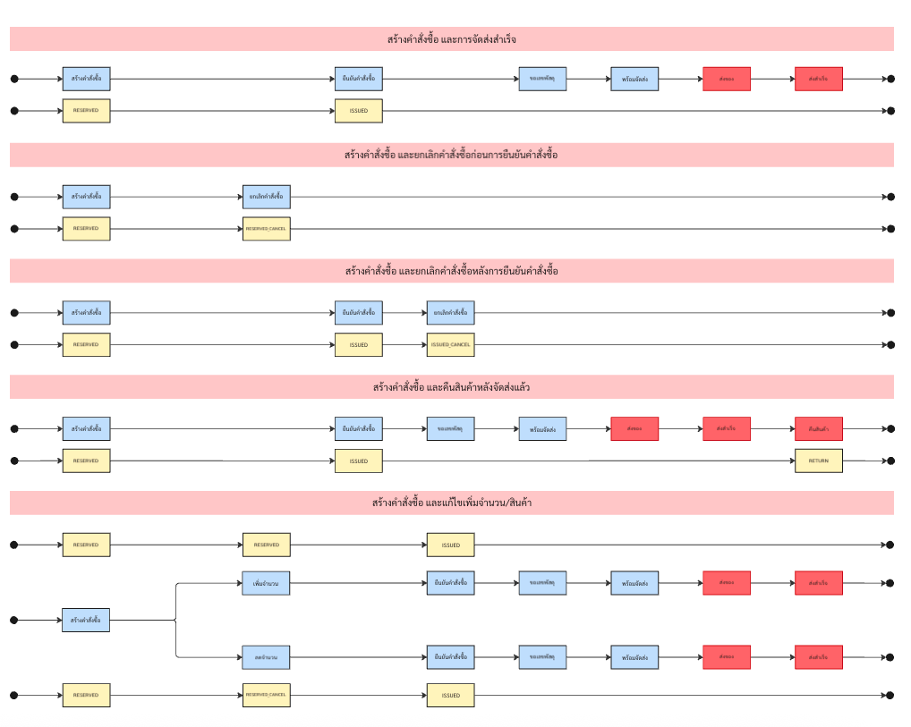
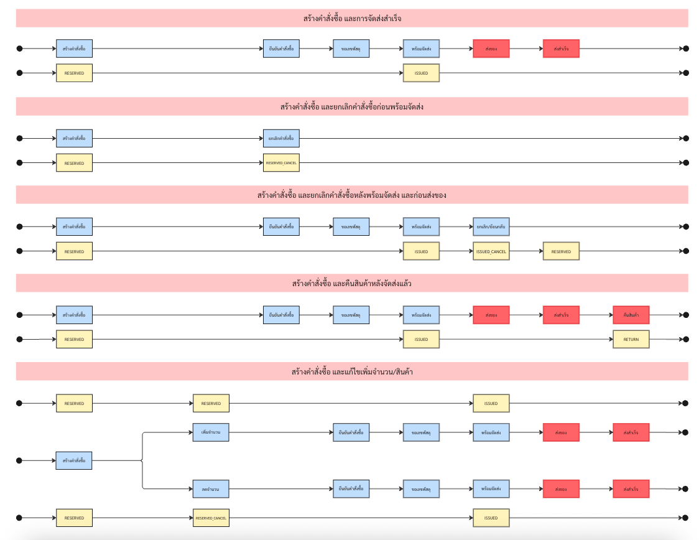

# 🚀 เวอร์ชั่น 2.0

## ⚙️ ตั้งค่าการตัดสต็อก {#setting}

`Stock V2` คือระบบบริหารจัดการสต็อกที่ออกแบบมาให้ **ยืดหยุ่น**, **แม่นยำ** และ **ควบคุมได้ตามธุรกิจจริง**  
โดยมีแนวทางหลักคือ:

---

✅ แนวคิดสำคัญ

- ทุกสินค้า **ต้องมีคลัง** (ระบุคลังในการจัดเก็บเสมอ)
- ทุกคำสั่งซื้อจะถูก **RESERVED (จองสินค้า)** ทันทีที่สร้าง
- การตัดสต็อกจริง (ISSUED) จะเกิดขึ้น **ตามจังหวะที่กำหนด**:
  - แบบที่ 1: ตัดทันทีเมื่อสร้างคำสั่งซื้อ
  - แบบที่ 2: ตัดเมื่อยืนยันคำสั่งซื้อ
  - แบบที่ 3: ตัดเมื่อเข้าสู่สถานะ “พร้อมจัดส่ง”

---

📦 ตัวเลือกการตัดสต็อก

| รูปแบบการตัดสต็อก             | RESERVED (จอง)         | ISSUED (ตัดของจริง)             | เหมาะสำหรับธุรกิจที่...                           |
|-------------------------------|-------------------------|----------------------------------|----------------------------------------------------|
| 1. ทันทีเมื่อสร้างคำสั่งซื้อ | เมื่อสร้างออเดอร์      | ทันทีเมื่อสร้างออเดอร์         | มีของพร้อมส่ง ต้องการความเร็ว                    |
| 2. เมื่อยืนยันคำสั่งซื้อ      | เมื่อสร้างออเดอร์      | เมื่อลูกค้ากดยืนยันคำสั่งซื้อ  | ต้องการตรวจสอบก่อนเบิก เช่น COD, รอตรวจสอบ      |
| 3. เมื่อพร้อมจัดส่ง          | เมื่อสร้างออเดอร์      | เมื่อคำสั่งซื้อเข้าสู่ “พร้อมจัดส่ง” | ใช้คลังกลาง แพ็กเมื่อพร้อมเท่านั้น (JIT)        |

---

🔍 กรณีที่รองรับในทุกรูปแบบการตัดสต็อก

ระบบ Stock V2 รองรับทุกกรณีต่อไปนี้:

| กรณีหลัก                           | รายละเอียด                                                                                   | การจัดการในระบบ                                                                 |
|------------------------------------|----------------------------------------------------------------------------------------------|----------------------------------------------------------------------------------|
| ✅ ส่งคำสั่งซื้อสำเร็จ             | จอง → ตัดสต็อก → ส่งของสำเร็จ                                                               | ไม่มีการคืนของ                                                                  |
| ❌ ยกเลิกก่อนตัดสต็อก              | จองไว้ → ยังไม่ตัดของ → ยกเลิก                                                               | ลบ `RESERVED` ทิ้ง                                                              |
| ❌ ยกเลิกหลังตัดสต็อก              | จองไว้ → ตัดของแล้ว → ยกเลิก                                                                | ทำ `ISSUED_CANCEL` → คืนของเข้าคลัง                                            |
| 🔁 คืนสินค้าหลังจัดส่ง             | สินค้าถูกจัดส่งแล้ว ลูกค้าขอคืน                                                              | บันทึกเป็น `RETURN`                                                             |
| 🔄 แก้ไขจำนวนก่อนตัดสต็อก          | เปลี่ยนจำนวนสินค้า ก่อน `ISSUED`                                                            | อัปเดต `RESERVED` และใช้ยอดล่าสุดเมื่อตัดสต็อก                               |
| 🔄 แก้ไขจำนวนหลังตัดสต็อก (เพิ่ม)  | ยืนยันแล้ว → ขอเพิ่มสินค้า                                                                   | จองเพิ่ม → ตัดเพิ่ม                                                              |
| 🔄 แก้ไขจำนวนหลังตัดสต็อก (ลด)    | ยืนยันแล้ว → ขอปรับลดจำนวน                                                                  | คืนส่วนที่ไม่ต้องการผ่าน `ISSUED_CANCEL`                                      |

---

📌 ตัวอย่าง Flow แต่ละรูปแบบ

| รูปแบบการตัดสต็อก               | RESERVED | ISSUED | ยกเลิกก่อน | ยกเลิกหลัง | คืนหลังส่ง | แก้ไขจำนวน (ก่อน) | แก้ไขจำนวน (หลัง) |
|-------------------------------|----------|--------|-------------|--------------|--------------|---------------------|----------------------|
| สร้างออเดอร์ = ตัดเลย        | ✅        | ✅     | ❌ ลบ + คืน | ✅ คืนคลัง    | ✅ RETURN     | ✅ ปรับจอง + ตัด    | ✅ เพิ่ม/คืน        |
| ยืนยันคำสั่งซื้อก่อนตัด      | ✅        | ❌     | ✅ ลบจอง    | ✅ คืนคลัง    | ✅ RETURN     | ✅ ปรับจอง + ตัด    | ✅ เพิ่ม/คืน        |
| พร้อมจัดส่งค่อยตัด          | ✅        | ❌     | ✅ ลบจอง    | ✅ คืนคลัง    | ✅ RETURN     | ✅ ปรับจอง + ตัด    | ✅ เพิ่ม/คืน        |

---

🧩 หมายเหตุเพิ่มเติม

- `RESERVED` เกิดทุกครั้งเมื่อสร้างคำสั่งซื้อ ไม่ว่าเลือกตัดสต็อกแบบใด  
- `ISSUED_CANCEL` ใช้คืนสินค้าเข้าคลังหลังจากตัดแล้ว  
- `RETURN` ใช้ในกรณีคืนสินค้าหลังจัดส่งสำเร็จ  
- ระบบรองรับการเปลี่ยนจำนวนและสินค้าได้ **ทั้งก่อนและหลังการตัดสต็อก**

---

### 🟢 1.) จองและตัดสต็อกทันที (เมื่อสร้างคำสั่งซื้อ) {#CREATE_ORDER}

> ระบบจะทำการ `RESERVED` (จองสินค้า) ทันทีเมื่อสร้างคำสั่งซื้อ  
> และจะ `ISSUED` (ตัดสต็อก) ทันทีเท่านั้น

#### ✅ กรณีที่ 1: สร้างคำสั่งซื้อ และการจัดส่งสำเร็จ

**ขั้นตอนการทำงาน:**
1. สร้างคำสั่งซื้อ  
2. `RESERVED` – จองสินค้าในคลัง  
3. `ISSUED` – เบิกสินค้า  
4. ยืนยันคำสั่งซื้อ  
5. ขอแพ็กพัสดุ  
6. พัสดุพร้อมส่ง  
7. ส่งของ  
8. ส่งสำเร็จ  

**🔚 ผลลัพธ์:**  
> สินค้าถูกจัดส่งถึงมือลูกค้าเรียบร้อย

---

#### ❌ กรณีที่ 2: สร้างคำสั่งซื้อ แต่ยกเลิกก่อนการจัดส่ง

**ขั้นตอนการทำงาน:**
1. สร้างคำสั่งซื้อ  
2. `RESERVED` – จองสินค้าในคลัง  
3. `ISSUED` – เบิกสินค้า  
4. ยกเลิกคำสั่งซื้อ  
5. `ISSUED_CANCEL` – คืนสินค้าเข้าคลัง  

**🔚 ผลลัพธ์:**  
> คำสั่งซื้อถูกยกเลิก → สินค้าถูกคืนเข้าคลัง

---

#### 🔁 กรณีที่ 3: สร้างคำสั่งซื้อ และลูกค้าคืนสินค้าหลังจัดส่ง

**ขั้นตอนการทำงาน:**
1. สร้างคำสั่งซื้อ  
2. `RESERVED`  
3. `ISSUED`  
4. ยืนยันคำสั่งซื้อ  
5. ขอแพ็กพัสดุ  
6. พัสดุพร้อมส่ง  
7. ส่งของ  
8. ส่งสำเร็จ  
9. ลูกค้าคืนสินค้า → `RETURN`  

**🔚 ผลลัพธ์:**  
> สินค้าถูกคืนภายหลังการจัดส่ง

---

#### 🔄 กรณีที่ 4: แก้ไขจำนวน/สินค้าในคำสั่งซื้อ

##### 📈 ตัวอย่างกรณี: เพิ่มจำนวนสินค้า  
> ลูกค้าสั่งสินค้า A จำนวน 1 ชิ้น → ภายหลังขอเปลี่ยนเป็น 3 ชิ้น

**ขั้นตอน:**
1. สร้างคำสั่งซื้อ (สินค้า A x1)  
2. `RESERVED` (จองสินค้า A x1)  
3. `ISSUED` (เบิกสินค้า A x1)  
4. ลูกค้าขอเพิ่มอีก 2 ชิ้น  
5. → `RESERVED` (จองเพิ่ม A x2)  
6. → `ISSUED` (เบิกเพิ่ม A x2)  
7. ยืนยันคำสั่งซื้อ  
8. ขอแพ็กพัสดุ  
9. พัสดุพร้อมส่ง  
10. ส่งของ  
11. ส่งสำเร็จ  

**🔚 ผลลัพธ์:**  
> สินค้ารวมที่จัดส่ง = A x3 → จัดส่งสำเร็จ

---

##### 📉 ตัวอย่างกรณี: ลดจำนวนสินค้า  
> ลูกค้าสั่งสินค้า B จำนวน 5 ชิ้น → ภายหลังขอเปลี่ยนเป็น 2 ชิ้น

**ขั้นตอน:**
1. สร้างคำสั่งซื้อ (สินค้า B x5)  
2. `RESERVED` (จองสินค้า B x5)  
3. `ISSUED` (เบิกสินค้า B x5)  
4. ลูกค้าขอลดเหลือ 2 ชิ้น  
5. → `ISSUED_CANCEL` (คืนสินค้า B x3 เข้าคลัง)  
6. ยืนยันคำสั่งซื้อ  
7. ขอแพ็กพัสดุ  
8. พัสดุพร้อมส่ง  
9. ส่งของ  
10. ส่งสำเร็จ  

**🔚 ผลลัพธ์:**  
> สินค้ารวมที่จัดส่ง = B x2 → ส่วนเกินถูกคืนเข้าคลัง

---

### 🕒 2.) จองและตัดสต็อกเมื่อ "ยืนยันคำสั่งซื้อ" {#CONFIRM_ORDER}
> ระบบจะทำการ `RESERVED` (จองสินค้า) ทันทีเมื่อสร้างคำสั่งซื้อ  
> และจะ `ISSUED` (ตัดสต็อก) เมื่อลูกค้าถูก **ยืนยันคำสั่งซื้อ** เท่านั้น

---

#### ✅ กรณีที่ 1: สร้างคำสั่งซื้อ และการจัดส่งสำเร็จ

**ลำดับขั้นตอน:**
1. สร้างคำสั่งซื้อ  
2. `RESERVED` → จองสินค้า  
3. ยืนยันคำสั่งซื้อ  
4. `ISSUED` → เบิกสินค้า  
5. ขอแพ็กพัสดุ  
6. พัสดุพร้อมส่ง  
7. ส่งของ  
8. ส่งสำเร็จ  

**ตัวอย่าง:**  
> ลูกค้าสั่งสินค้า A จำนวน 2 ชิ้น  
> → ระบบจองทันที  
> → เมื่อยืนยัน ระบบตัดสต็อก  
> → จัดส่งสำเร็จตามปกติ

**ผลลัพธ์:**  
> สินค้าถูกจัดส่งสำเร็จหลังการยืนยัน

---

#### ❌ กรณีที่ 2: สร้างคำสั่งซื้อ และยกเลิกคำสั่งซื้อก่อนการยืนยัน

**ลำดับขั้นตอน:**
1. สร้างคำสั่งซื้อ  
2. `RESERVED` → จองสินค้า  
3. ยกเลิกคำสั่งซื้อ (ก่อนยืนยัน)  
4. `RESERVED` → ถูกลบออก  

**ตัวอย่าง:**  
> ลูกค้าสั่งสินค้า B จำนวน 3 ชิ้น  
> → ระบบจองทันที  
> → แต่ลูกค้ายกเลิกก่อนยืนยัน  
> → ระบบลบการจองออกโดยไม่ตัดสต็อก

**ผลลัพธ์:**  
> ไม่เกิดการเบิกสินค้า → จองถูกลบ

---

#### ❌ กรณีที่ 3: สร้างคำสั่งซื้อ และยกเลิกคำสั่งซื้อหลังการยืนยัน

**ลำดับขั้นตอน:**
1. สร้างคำสั่งซื้อ  
2. `RESERVED`  
3. ยืนยันคำสั่งซื้อ  
4. `ISSUED`  
5. ยกเลิกคำสั่งซื้อ  
6. `ISSUED_CANCEL` → คืนสินค้ากลับคลัง  

**ตัวอย่าง:**  
> ลูกค้าสั่งสินค้า C จำนวน 4 ชิ้น  
> → ระบบจอง + ยืนยัน → ระบบเบิก  
> → ลูกค้ายกเลิกภายหลัง  
> → ระบบคืนสินค้า C x4 เข้าคลัง

**ผลลัพธ์:**  
> สินค้าถูกคืนหลังการตัดสต็อก

---

#### 🔄 กรณีที่ 4: สร้างคำสั่งซื้อ และแก้ไขเพิ่มจำนวน/สินค้า

##### 📈 เพิ่มจำนวน **ก่อนยืนยัน**

**ลำดับขั้นตอน:**
1. สร้างคำสั่งซื้อ สินค้า D x1  
2. `RESERVED` → D x1  
3. ลูกค้าขอเพิ่มเป็น D x3  
4. ระบบอัปเดต `RESERVED` → D x3  
5. ยืนยันคำสั่งซื้อ  
6. `ISSUED` → D x3  
7. จัดส่งปกติ

**ผลลัพธ์:**  
> เบิกและส่งสินค้าตามจำนวนล่าสุดที่แก้ไข

---

##### 📈 เพิ่มจำนวน **หลังยืนยัน**

**ลำดับขั้นตอน:**
1. สร้างคำสั่งซื้อ D x2  
2. `RESERVED` → D x2  
3. ยืนยันคำสั่งซื้อ → `ISSUED` D x2  
4. ลูกค้าขอเพิ่ม D x1  
5. ระบบทำ `RESERVED` + `ISSUED` เพิ่ม D x1  
6. รวม = D x3

**ผลลัพธ์:**  
> ตัดสต็อกเพิ่มตามยอดที่เพิ่มหลังยืนยัน

---

##### 📉 ลดจำนวน **หลังยืนยัน**

**ลำดับขั้นตอน:**
1. สร้างคำสั่งซื้อ D x5  
2. `RESERVED` → D x5  
3. ยืนยันคำสั่งซื้อ → `ISSUED` D x5  
4. ลูกค้าขอลดเหลือ D x2  
5. `ISSUED_CANCEL` → คืน D x3  

**ผลลัพธ์:**  
> เบิกเท่าที่ต้องส่งจริง → คืนส่วนเกินกลับคลัง

---

##### 🛑 ยกเลิกคำสั่งซื้อ หลังแก้ไข

- หากยังไม่ยืนยัน → ลบ `RESERVED` ตามยอดล่าสุด  
- หากยืนยันแล้ว → คืนสินค้าทั้งหมดที่ถูกเบิกไป (`ISSUED_CANCEL`)

---

📌 สรุปสั้น ๆ:

| กรณี                              | RESERVED | ISSUED | การคืนของ       |
|-----------------------------------|----------|--------|------------------|
| สร้างและส่งสำเร็จ               | ✅       | ✅     | ❌               |
| ยกเลิกก่อนยืนยัน                | ✅       | ❌     | ❌ (ลบจองออก)     |
| ยกเลิกหลังยืนยัน                | ✅       | ✅     | ✅ (คืนเข้าคลัง)  |
| แก้ไขก่อนยืนยัน                 | ✅ (ปรับยอด) | ✅ ตามยอดล่าสุด | ❌ |
| แก้ไขหลังยืนยัน (เพิ่ม)         | ✅       | ✅ เพิ่มเฉพาะที่เพิ่ม | ❌ |
| แก้ไขหลังยืนยัน (ลด)           | ✅       | ✅ แล้วคืนส่วนเกิน | ✅ |

---

### 📦 3.) จองและตัดสต็อกเมื่อ "พร้อมจัดส่ง" {#READY_TO_SHIP}
> ระบบจะ `RESERVED` (จองสินค้า) ตั้งแต่มีการสร้างคำสั่งซื้อ  
> และ `ISSUED` (ตัดสต็อก) จะเกิด **เมื่อคำสั่งซื้อเข้าสู่สถานะ “พร้อมจัดส่ง”** เท่านั้น

---

#### ✅ กรณีที่ 1: สร้างคำสั่งซื้อ และการจัดส่งสำเร็จ

**ลำดับขั้นตอน:**
1. สร้างคำสั่งซื้อ  
2. `RESERVED` → จองสินค้า  
3. ยืนยันคำสั่งซื้อ  
4. ขอแพ็กพัสดุ  
5. **พัสดุพร้อมส่ง** → `ISSUED` → ตัดสต็อก  
6. ส่งของ  
7. ส่งสำเร็จ  

**ตัวอย่าง:**  
> ลูกค้าสั่งสินค้า A จำนวน 2 ชิ้น  
> ระบบจองสินค้า A x2  
> เมื่อออเดอร์เข้าสู่สถานะ “พัสดุพร้อมส่ง” → ระบบจึงเบิก A x2  
> ดำเนินการส่งจนสำเร็จ

**ผลลัพธ์:**  
> ระบบเบิกสินค้า ณ จุดที่พร้อมส่งจริงเท่านั้น

---

#### ❌ กรณีที่ 2: สร้างคำสั่งซื้อ และยกเลิกก่อน “พร้อมจัดส่ง”

**ลำดับขั้นตอน:**
1. สร้างคำสั่งซื้อ  
2. `RESERVED`  
3. ยกเลิกคำสั่งซื้อ (ก่อนถึง "พร้อมจัดส่ง")  

**ตัวอย่าง:**  
> ลูกค้าสั่งสินค้า B จำนวน 3 ชิ้น  
> ระบบจองสินค้าไว้  
> แต่ลูกค้ายกเลิกก่อนถึงขั้นตอนแพ็กพัสดุหรือพร้อมส่ง  
> → ระบบลบการจอง (ไม่ต้องคืนของเพราะยังไม่ตัดสต็อก)

**ผลลัพธ์:**  
> ไม่มีการเบิกสินค้า → จองถูกยกเลิก

---

#### ❌ กรณีที่ 3: ยกเลิกคำสั่งซื้อหลัง “พร้อมจัดส่ง” แต่ก่อนส่งของ

**ลำดับขั้นตอน:**
1. สร้างคำสั่งซื้อ  
2. `RESERVED`  
3. ยืนยันคำสั่งซื้อ  
4. ขอแพ็กพัสดุ  
5. พัสดุพร้อมส่ง → `ISSUED`  
6. ยกเลิกคำสั่งซื้อ  
7. `ISSUED_CANCEL` → คืนคลัง  

**ตัวอย่าง:**  
> ลูกค้าสั่งสินค้า C จำนวน 1 ชิ้น  
> เมื่อพร้อมจัดส่ง ระบบตัดสต็อก  
> แต่ลูกค้ายกเลิกก่อนส่งจริง → ระบบต้องคืนสินค้า C x1

**ผลลัพธ์:**  
> ระบบคืนสินค้าที่เบิกแล้วกลับเข้าคลัง

---

#### 🔁 กรณีที่ 4: สร้างคำสั่งซื้อ และคืนสินค้าหลังจัดส่งแล้ว

**ลำดับขั้นตอน:**
1. สร้างคำสั่งซื้อ  
2. `RESERVED`  
3. ยืนยันคำสั่งซื้อ  
4. ขอแพ็กพัสดุ  
5. พัสดุพร้อมส่ง → `ISSUED`  
6. ส่งของ → ส่งสำเร็จ  
7. ลูกค้าคืนสินค้า → `RETURN`  

**ตัวอย่าง:**  
> ลูกค้าสั่งสินค้า D x1 → จัดส่งสำเร็จ  
> ภายหลังลูกค้าคืนสินค้า  
> → ระบบบันทึกการคืนเข้า `RETURN`

**ผลลัพธ์:**  
> รองรับคืนสินค้าหลังการส่งสำเร็จ

---

#### 🔄 กรณีที่ 5: แก้ไขจำนวน/สินค้า

##### 📈 เพิ่มจำนวน (ก่อนถึง “พร้อมจัดส่ง”)

**ลำดับขั้นตอน:**
1. สร้างคำสั่งซื้อ D x1  
2. `RESERVED` → D x1  
3. ลูกค้าขอเพิ่มเป็น D x3  
4. ระบบอัปเดต `RESERVED`  
5. เมื่อถึง “พร้อมจัดส่ง” → `ISSUED` D x3

**ผลลัพธ์:**  
> ระบบเบิกจำนวนล่าสุดเท่านั้น → ไม่มีขั้นตอนคืนของ

---

##### 📉 ลดจำนวน (ก่อนถึง “พร้อมจัดส่ง”)

**ลำดับขั้นตอน:**
1. สร้างคำสั่งซื้อ D x5  
2. `RESERVED` → D x5  
3. ลูกค้าขอลดเหลือ D x2  
4. ระบบอัปเดต `RESERVED`  
5. “พร้อมจัดส่ง” → `ISSUED` D x2

**ผลลัพธ์:**  
> ระบบเบิกตามจำนวนล่าสุดเท่านั้น

---

##### 🛑 ยกเลิกหลังเข้าสถานะ “พร้อมจัดส่ง”

**ลำดับขั้นตอน:**
- หากระบบได้ `ISSUED` ไปแล้ว → จะ `ISSUED_CANCEL` คืนคลัง

---

📌 สรุปสั้น ๆ:

| กรณี                              | RESERVED | ISSUED | การคืนของ       |
|-----------------------------------|----------|--------|------------------|
| สร้างและส่งสำเร็จ               | ✅       | ✅     | ❌               |
| ยกเลิกก่อน “พร้อมจัดส่ง”        | ✅       | ❌     | ❌ (ลบจอง)        |
| ยกเลิกหลัง “พร้อมจัดส่ง”        | ✅       | ✅     | ✅ (คืนคลัง)      |
| คืนสินค้าหลังจัดส่ง             | ✅       | ✅     | ✅ (`RETURN`)     |
| แก้ไขก่อนพร้อมจัดส่ง            | ✅ (อัปเดต) | ✅ ตามยอดล่าสุด | ❌ |

---
