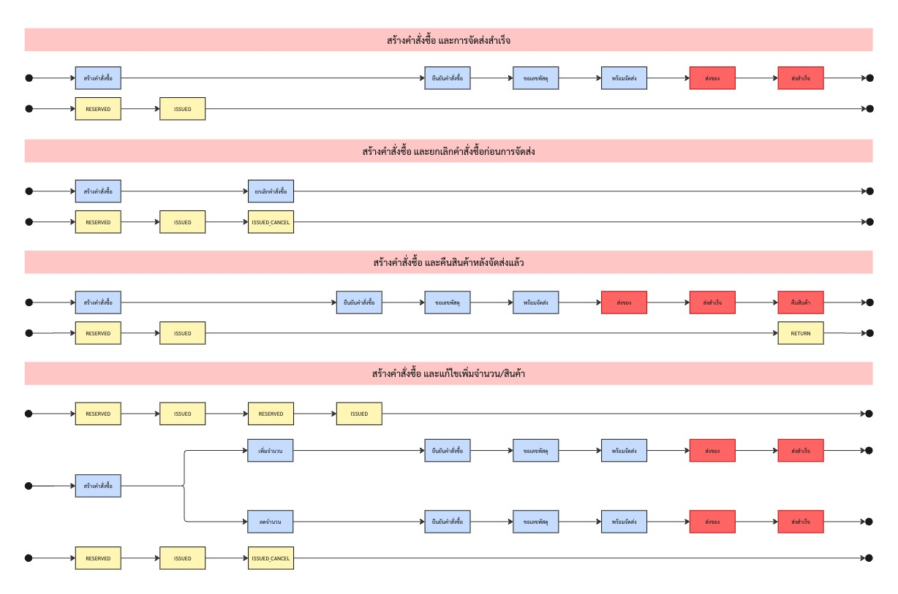

# 🚀 เวอร์ชั่น 2.0

## ⚙️ ตั้งค่าการตัดสต็อก {#setting}
Stock V2 คือระบบบริหารจัดการคลังสินค้าแบบใหม่ ที่ออกแบบมาเพื่อให้การจัดการสต็อกเป็นเรื่องง่ายและแม่นยำมากยิ่งขึ้น โดยมีแนวคิดหลักคือ:

✅ ทุกสินค้า จะต้องมีคลังเสมอ

🔒 ทุกคำสั่งซื้อ จะมีการจองสินค้า (Reserve)

⚙️ สามารถตั้งค่าจังหวะการตัดสต็อกได้ตามกระบวนการที่ต้องการ

💡 ช่วยให้คุณ:
ลดข้อผิดพลาดจากการขายเกินสต็อก (Overselling)

มองเห็นสถานะของสินค้าชัดเจนในทุกขั้นตอน

ปรับแต่งจังหวะการตัดสต็อกให้เหมาะกับรูปแบบธุรกิจ เช่น:

ตัดทันทีเมื่อสร้างคำสั่งซื้อ

ตัดเมื่อยืนยันคำสั่งซื้อ

ตัดเมื่อเข้าสู่สถานะพร้อมจัดส่ง

---

### 🟢 1.) จองและตัดสต็อกทันที (เมื่อสร้างคำสั่งซื้อ) {#CREATE_ORDER}

#### ✅ กรณีที่ 1: สร้างคำสั่งซื้อ และการจัดส่งสำเร็จ

**ขั้นตอนการทำงาน:**
1. สร้างคำสั่งซื้อ  
2. `RESERVED` – จองสินค้าในคลัง  
3. `ISSUED` – เบิกสินค้า  
4. ยืนยันคำสั่งซื้อ  
5. ขอแพ็กพัสดุ  
6. พัสดุพร้อมส่ง  
7. ส่งของ  
8. ส่งสำเร็จ  

**🔚 ผลลัพธ์:**  
> สินค้าถูกจัดส่งถึงมือลูกค้าเรียบร้อย

---

#### ❌ กรณีที่ 2: สร้างคำสั่งซื้อ แต่ยกเลิกก่อนการจัดส่ง

**ขั้นตอนการทำงาน:**
1. สร้างคำสั่งซื้อ  
2. `RESERVED` – จองสินค้าในคลัง  
3. `ISSUED` – เบิกสินค้า  
4. ยกเลิกคำสั่งซื้อ  
5. `ISSUED_CANCEL` – คืนสินค้าเข้าคลัง  

**🔚 ผลลัพธ์:**  
> คำสั่งซื้อถูกยกเลิก → สินค้าถูกคืนเข้าคลัง

---

#### 🔁 กรณีที่ 3: สร้างคำสั่งซื้อ และลูกค้าคืนสินค้าหลังจัดส่ง

**ขั้นตอนการทำงาน:**
1. สร้างคำสั่งซื้อ  
2. `RESERVED`  
3. `ISSUED`  
4. ยืนยันคำสั่งซื้อ  
5. ขอแพ็กพัสดุ  
6. พัสดุพร้อมส่ง  
7. ส่งของ  
8. ส่งสำเร็จ  
9. ลูกค้าคืนสินค้า → `RETURN`  

**🔚 ผลลัพธ์:**  
> สินค้าถูกคืนภายหลังการจัดส่ง

---

#### 🔄 กรณีที่ 4: แก้ไขจำนวน/สินค้าในคำสั่งซื้อ

##### 📈 ตัวอย่างกรณี: เพิ่มจำนวนสินค้า  
> ลูกค้าสั่งสินค้า A จำนวน 1 ชิ้น → ภายหลังขอเปลี่ยนเป็น 3 ชิ้น

**ขั้นตอน:**
1. สร้างคำสั่งซื้อ (สินค้า A x1)  
2. `RESERVED` (จองสินค้า A x1)  
3. `ISSUED` (เบิกสินค้า A x1)  
4. ลูกค้าขอเพิ่มอีก 2 ชิ้น  
5. → `RESERVED` (จองเพิ่ม A x2)  
6. → `ISSUED` (เบิกเพิ่ม A x2)  
7. ยืนยันคำสั่งซื้อ  
8. ขอแพ็กพัสดุ  
9. พัสดุพร้อมส่ง  
10. ส่งของ  
11. ส่งสำเร็จ  

**🔚 ผลลัพธ์:**  
> สินค้ารวมที่จัดส่ง = A x3 → จัดส่งสำเร็จ

---

##### 📉 ตัวอย่างกรณี: ลดจำนวนสินค้า  
> ลูกค้าสั่งสินค้า B จำนวน 5 ชิ้น → ภายหลังขอเปลี่ยนเป็น 2 ชิ้น

**ขั้นตอน:**
1. สร้างคำสั่งซื้อ (สินค้า B x5)  
2. `RESERVED` (จองสินค้า B x5)  
3. `ISSUED` (เบิกสินค้า B x5)  
4. ลูกค้าขอลดเหลือ 2 ชิ้น  
5. → `ISSUED_CANCEL` (คืนสินค้า B x3 เข้าคลัง)  
6. ยืนยันคำสั่งซื้อ  
7. ขอแพ็กพัสดุ  
8. พัสดุพร้อมส่ง  
9. ส่งของ  
10. ส่งสำเร็จ  

**🔚 ผลลัพธ์:**  
> สินค้ารวมที่จัดส่ง = B x2 → ส่วนเกินถูกคืนเข้าคลัง

---

### 🕒 2.) จองและตัดสต็อกเมื่อ "ยืนยันคำสั่งซื้อ" {#CONFIRM_ORDER}

> ระบบจะทำการ `RESERVED` (จองสินค้า) ทันทีเมื่อสร้างคำสั่งซื้อ  
> และจะ `ISSUED` (ตัดสต็อก) เมื่อลูกค้าถูก **ยืนยันคำสั่งซื้อ** เท่านั้น

---

#### ✅ กรณีที่ 1: สร้างคำสั่งซื้อ และการจัดส่งสำเร็จ

**ลำดับขั้นตอน:**
1. สร้างคำสั่งซื้อ  
2. `RESERVED` → จองสินค้า  
3. ยืนยันคำสั่งซื้อ  
4. `ISSUED` → เบิกสินค้า  
5. ขอแพ็กพัสดุ  
6. พัสดุพร้อมส่ง  
7. ส่งของ  
8. ส่งสำเร็จ  

**ตัวอย่าง:**  
> ลูกค้าสั่งสินค้า A จำนวน 2 ชิ้น  
> → ระบบจองทันที  
> → เมื่อยืนยัน ระบบตัดสต็อก  
> → จัดส่งสำเร็จตามปกติ

**ผลลัพธ์:**  
> สินค้าถูกจัดส่งสำเร็จหลังการยืนยัน

---

#### ❌ กรณีที่ 2: สร้างคำสั่งซื้อ และยกเลิกคำสั่งซื้อก่อนการยืนยัน

**ลำดับขั้นตอน:**
1. สร้างคำสั่งซื้อ  
2. `RESERVED` → จองสินค้า  
3. ยกเลิกคำสั่งซื้อ (ก่อนยืนยัน)  
4. `RESERVED` → ถูกลบออก  

**ตัวอย่าง:**  
> ลูกค้าสั่งสินค้า B จำนวน 3 ชิ้น  
> → ระบบจองทันที  
> → แต่ลูกค้ายกเลิกก่อนยืนยัน  
> → ระบบลบการจองออกโดยไม่ตัดสต็อก

**ผลลัพธ์:**  
> ไม่เกิดการเบิกสินค้า → จองถูกลบ

---

#### ❌ กรณีที่ 3: สร้างคำสั่งซื้อ และยกเลิกคำสั่งซื้อหลังการยืนยัน

**ลำดับขั้นตอน:**
1. สร้างคำสั่งซื้อ  
2. `RESERVED`  
3. ยืนยันคำสั่งซื้อ  
4. `ISSUED`  
5. ยกเลิกคำสั่งซื้อ  
6. `ISSUED_CANCEL` → คืนสินค้ากลับคลัง  

**ตัวอย่าง:**  
> ลูกค้าสั่งสินค้า C จำนวน 4 ชิ้น  
> → ระบบจอง + ยืนยัน → ระบบเบิก  
> → ลูกค้ายกเลิกภายหลัง  
> → ระบบคืนสินค้า C x4 เข้าคลัง

**ผลลัพธ์:**  
> สินค้าถูกคืนหลังการตัดสต็อก

---

#### 🔄 กรณีที่ 4: สร้างคำสั่งซื้อ และแก้ไขเพิ่มจำนวน/สินค้า

##### 📈 เพิ่มจำนวน **ก่อนยืนยัน**

**ลำดับขั้นตอน:**
1. สร้างคำสั่งซื้อ สินค้า D x1  
2. `RESERVED` → D x1  
3. ลูกค้าขอเพิ่มเป็น D x3  
4. ระบบอัปเดต `RESERVED` → D x3  
5. ยืนยันคำสั่งซื้อ  
6. `ISSUED` → D x3  
7. จัดส่งปกติ

**ผลลัพธ์:**  
> เบิกและส่งสินค้าตามจำนวนล่าสุดที่แก้ไข

---

##### 📈 เพิ่มจำนวน **หลังยืนยัน**

**ลำดับขั้นตอน:**
1. สร้างคำสั่งซื้อ D x2  
2. `RESERVED` → D x2  
3. ยืนยันคำสั่งซื้อ → `ISSUED` D x2  
4. ลูกค้าขอเพิ่ม D x1  
5. ระบบทำ `RESERVED` + `ISSUED` เพิ่ม D x1  
6. รวม = D x3

**ผลลัพธ์:**  
> ตัดสต็อกเพิ่มตามยอดที่เพิ่มหลังยืนยัน

---

##### 📉 ลดจำนวน **หลังยืนยัน**

**ลำดับขั้นตอน:**
1. สร้างคำสั่งซื้อ D x5  
2. `RESERVED` → D x5  
3. ยืนยันคำสั่งซื้อ → `ISSUED` D x5  
4. ลูกค้าขอลดเหลือ D x2  
5. `ISSUED_CANCEL` → คืน D x3  

**ผลลัพธ์:**  
> เบิกเท่าที่ต้องส่งจริง → คืนส่วนเกินกลับคลัง

---

##### 🛑 ยกเลิกคำสั่งซื้อ หลังแก้ไข

- หากยังไม่ยืนยัน → ลบ `RESERVED` ตามยอดล่าสุด  
- หากยืนยันแล้ว → คืนสินค้าทั้งหมดที่ถูกเบิกไป (`ISSUED_CANCEL`)

---

📌 สรุปสั้น ๆ:

| กรณี                              | RESERVED | ISSUED | การคืนของ       |
|-----------------------------------|----------|--------|------------------|
| สร้างและส่งสำเร็จ               | ✅       | ✅     | ❌               |
| ยกเลิกก่อนยืนยัน                | ✅       | ❌     | ❌ (ลบจองออก)     |
| ยกเลิกหลังยืนยัน                | ✅       | ✅     | ✅ (คืนเข้าคลัง)  |
| แก้ไขก่อนยืนยัน                 | ✅ (ปรับยอด) | ✅ ตามยอดล่าสุด | ❌ |
| แก้ไขหลังยืนยัน (เพิ่ม)         | ✅       | ✅ เพิ่มเฉพาะที่เพิ่ม | ❌ |
| แก้ไขหลังยืนยัน (ลด)           | ✅       | ✅ แล้วคืนส่วนเกิน | ✅ |

---

### 📦 3.) จองและตัดสต็อกเมื่อ "พร้อมจัดส่ง" {#READY_TO_SHIP}

> ระบบจะทำการ `RESERVED` และ `ISSUED` ทันทีเมื่อคำสั่งซื้อถูกย้ายไปสถานะ "พร้อมจัดส่ง"

---
