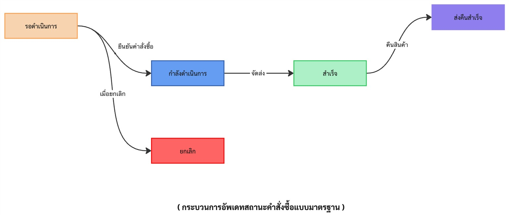

# สถานะคำสั่งซื้อ (ทดสอบ)

เพื่อให้การสื่อสารระหว่างระบบและทีมพัฒนามีความชัดเจน การกำหนด **“สถานะคำสั่งซื้อมาตรฐาน”** จึงเป็นสิ่งจำเป็น เพื่อใช้เป็นจุดอ้างอิงกลางสำหรับทุกระบบที่เกี่ยวข้อง โดยแต่ละช่องทาง (เช่น เว็บไซต์, แอป, หรือช่องทางภายนอก) ควรแมปสถานะของตนเองให้สัมพันธ์กับสถานะมาตรฐานนี้ เพื่อให้เกิดความเข้าใจตรงกันทั้งในเชิงระบบและธุรกิจ

:::caution

สถานะของระบบภายนอกหรือแพลตฟอร์มอื่น ๆ อาจมีการเปลี่ยนแปลง หรืออาจไม่ตรงตามที่ระบุไว้ในเอกสารนี้ทั้งหมด  
จึงควรมีการ **ตรวจสอบและยืนยันกับระบบต้นทาง** เสมอ ก่อนนำไปใช้งานจริง หรือเชื่อมโยงสถานะเข้ากับระบบภายใน

:::

## กฏเบื้องต้น {#rules}

Modify `docusaurus.config.js` to add support for the `fr` locale:

```js title="docusaurus.config.js"
export default {
  i18n: {
    defaultLocale: 'en',
    locales: ['en', 'fr'],
  },
};
```

## สถานะคำสั่งซื้อมาตรฐาน {#standard}

หน้านี้แสดงรายละเอียดของสถานะคำสั่งซื้อในระบบ เพื่อให้ทีมที่เกี่ยวข้องสามารถใช้อ้างอิงร่วมกันระหว่างระบบภายในและแพลตฟอร์ม MKP (Marketplace)



ตารางด้านล่างแสดงรายการสถานะคำสั่งซื้อที่ใช้ภายในระบบ พร้อมคำอธิบายและเงื่อนไขที่เกี่ยวข้อง เพื่อใช้เป็นมาตรฐานร่วมกับทีมพัฒนาและระบบภายนอก (MKP)

| สถานะ (TH) | สถานะ (EN) | ความหมาย / เงื่อนไข |
|------------|------------|------------------------|
| รอดำเนินการ | Pending | คำสั่งซื้อที่สร้างแล้ว แต่ยังไม่ได้รับการชำระเงิน หรือยังไม่ได้รับการยืนยันจาก MKP |
| ยืนยันแล้ว | Confirmed | ได้รับการยืนยันชำระเงินจาก MKP แล้ว ระบบสามารถดำเนินการขั้นตอนถัดไปได้ |
| ยกเลิก | Cancelled | คำสั่งซื้อถูกยกเลิกโดยผู้ใช้ หรือระบบ เนื่องจากเกินระยะเวลาที่กำหนด หรือมีปัญหาในการชำระเงิน |
| กำลังจัดส่ง | Shipping | ระบบได้ส่งคำสั่งซื้อไปยังคลังสินค้าแล้ว และอยู่ระหว่างการจัดส่ง |
| จัดส่งสำเร็จ | Delivered | รายการถูกจัดส่งสำเร็จและมีการยืนยันการรับสินค้าแล้ว |
| คืนเงิน | Refunded | ระบบได้ทำการคืนเงินให้ลูกค้าเรียบร้อยแล้ว |

### Tiktok Shop {#tiktokshop}

Start your site on the French locale:

```bash
npm run start -- --locale fr
```

Your localized site is accessible at [http://localhost:3000/fr/](http://localhost:3000/fr/) and the `Getting Started` page is translated.

:::caution

In development, you can only use one locale at a time.

:::

### Lazada {#lazada}

To navigate seamlessly across languages, add a locale dropdown.

Modify the `docusaurus.config.js` file:

```js title="docusaurus.config.js"
export default {
  themeConfig: {
    navbar: {
      items: [
        // highlight-start
        {
          type: 'localeDropdown',
        },
        // highlight-end
      ],
    },
  },
};
```

The locale dropdown now appears in your navbar:


### Shopee {#shopee}

ดูรายละเอียดเพิ่มเติมได้ที่ [Shopee Order Status Documentation](https://your-docs-site.com/docs/module-process/order-process/shopee)

Build your site for a specific locale:

```bash
npm run build -- --locale fr
```

Or build your site to include all the locales at once:

```bash
npm run build
```

### LineShoping {#lineshoping}

Build your site for a specific locale:

```bash
npm run build -- --locale fr
```

Or build your site to include all the locales at once:

```bash
npm run build
```

### Magento2 {#magento2}

Build your site for a specific locale:

```bash
npm run build -- --locale fr
```

Or build your site to include all the locales at once:

```bash
npm run build
```

### WooCommerce {#woocommerce}

Build your site for a specific locale:

```bash
npm run build -- --locale fr
```

Or build your site to include all the locales at once:

```bash
npm run build
```

## คำถามที่พบบ่อย {#faq}

Build your site for a specific locale:

```bash
npm run build -- --locale fr
```

Or build your site to include all the locales at once:

```bash
npm run build
```

### คำสั่งซื้อ {#faq-sales-order}

🔹 1. ต้องติดตั้งระบบอย่างไร?

กรุณาดูที่ [⚙️ ขั้นตอนการเปิดใช้งานระบบ](./system-activation)  
หรือรันคำสั่งตามนี้ใน terminal:

```bash
npm install
npm run start
```

### การจัดส่ง {#faq-shipment}

Build your site for a specific locale:

```bash
npm run build -- --locale fr
```

Or build your site to include all the locales at once:

```bash
npm run build
```